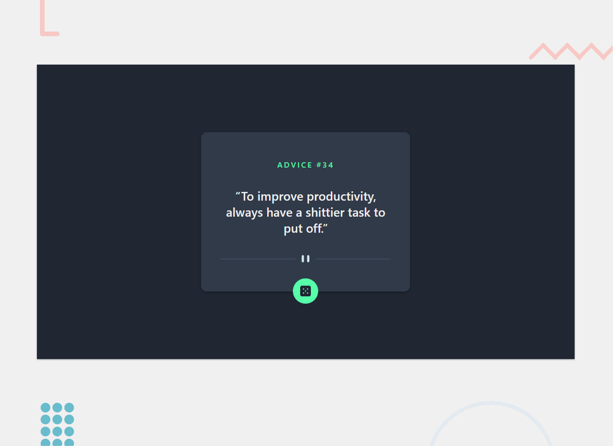
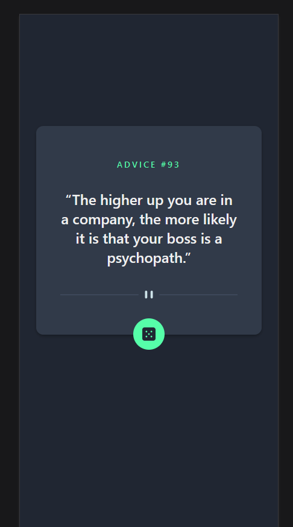

# Frontend Mentor - Advice generator app solution

This is a solution to the [Advice generator app challenge on Frontend Mentor](https://www.frontendmentor.io/challenges/advice-generator-app-QdUG-13db). Frontend Mentor challenges help you improve your coding skills by building realistic projects.

## Table of contents

- [Overview](#overview)
  - [The challenge](#the-challenge)
  - [Screenshot](#screenshot)
  - [Links](#links)
- [My process](#my-process)
  - [Built with](#built-with)
  - [What I learned](#what-i-learned)
  - [Continued development](#continued-development)
- [Author](#author)

## Overview

### The challenge

Users should be able to:

- Click the Green button to request a new Quote (doesn't work not sure why)

### Screenshot
- Desktop Version

- Mobile Version - Border is from firefox mobile debugging view, not part of actual mobile version

### Links

- Solution URL: [Add solution URL here](https://github.com/Zeus-The-Cat/advice-generator-app-main)
- Live Site URL: [Add live site URL here](https://advice-generator-app-main-alpha.vercel.app/)

## My process

- Expected Dev time 4 hrs
- Actual Dev time   3 hrs
- Spent some time reading Styled-Components docs

### Built with

- Flexbox
- Mobile-first workflow
- [React](https://reactjs.org/) - JS library
- [Next.js](https://nextjs.org/) - React framework
- [Styled Components](https://styled-components.com/) - For styles
- [Canva](https://www.canva.com/) - Custom SVGs

### What I learned

- Nextjs with styled-component [live-example](https://github.com/vercel/next.js/tree/main/examples/with-styled-components)
- Created a useMediaQuery Hook for future use

### Continued development

- I'm not exactly sure why the API won't send a new quote, I think they have a cache setup, or maybe Nextjs is messing with it, not sure, could be a mistake on their end. 

## Author

- Website - [Dakotah Pettry](https://www.your-site.com)
- Frontend Mentor - [@Zeus-The-Cat](https://www.frontendmentor.io/profile/Zeus-The-Cat)
- Twitter - [@dakotah_pettry](https://www.twitter.com/dakotah_pettry)

